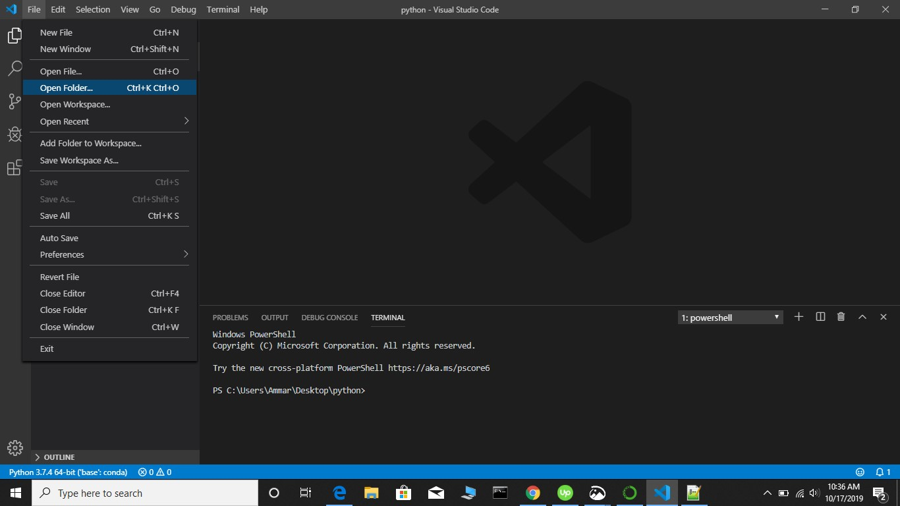

# Tutorial for spaCy and markovify installation
- In this tutorial we are going to show how to install spacy. So first of all what is spaCyy? 
spaCy is an open-source software library for advanced natural language processing, written in the programming languages Python and Cython. For more information about spaCy usage and other features have a look [here](https://spacy.io/usage/spacy-101).

- Natural language processing (NLP) is a subfield of linguistics, computer science, information engineering, and 
artificial intelligence concerned with the interactions between computers and human (natural) languages,
in particular how to program computers to process and analyze large amounts of natural language data. 

- So lets move onto spaCy installation. We will install spaCy using Anaconda. For easily installing python packages on windows install [Anaconda](https://www.anaconda.com/distribution/). Keep in mind that this link is has both 64 bit and 32 bit
distributions of Anaconda you should choose which suits your system. Here is a very [cool guide](https://problemsolvingwithpython.com/01-Orientation/01.03-Installing-Anaconda-on-Windows/) for installing Anaconda for with recommended options that will be used for this tutorial. 

- After you install Anaconda write Anaconda in the search button of windows and click on Anaconda prompt as shown below:
 
  

- Open Anaconda prompt and type: 


```
conda install -c conda-forge spaCy
```

- This is shown in screenshot given below as 


- For installing Markovify write following code:

```
conda install -c conda-forge markovify
```

- This is shown in screenshot given below as 


If there are no errors during installation and you start watching the conda prompt blinking again then this means that spaCy and markovify has been installed correctly.


## Working with spaCy

- For ease of useness we will be using visual studio code that comes with Anaconda. Click on Anaconda Navigator as shown below:
  
  


- Click on Visual studio code and open it as shown below:


- Now we will work with spaCy in Visual Studio code. For working with python in visual studio code just create a folder titled **python_code** on Desktop as shown below


- Choose the option for folder in Visual studio as shown below:



- Now open this folder in Visual Studion as shown below:


- Create a file in python_code folder named spacy_tutorial with code given below

```
import spacy
import markovify
```
- This is shown as below:


- Import spacy using the code given below:


- Now open this file in Visual studio as given below: 


Compile this code using the green option on top of the compiler as given below:
Screen11

You have to compile all the code as shown in the above screenshot.

Now if you have not got any errors in visual studio while compiling the code then it means that spacy has been imported successfully. 
Now we will move further with our tasks related to natural language processing. This tutorial will focus on following aspects of natural language processing:

Tokenization
Lemmatization
Stemming
Partsarts of speech tagging
Entity Detection
Dependency Parsing
Word Vector Representation
Text Classification

Sc2reen10

