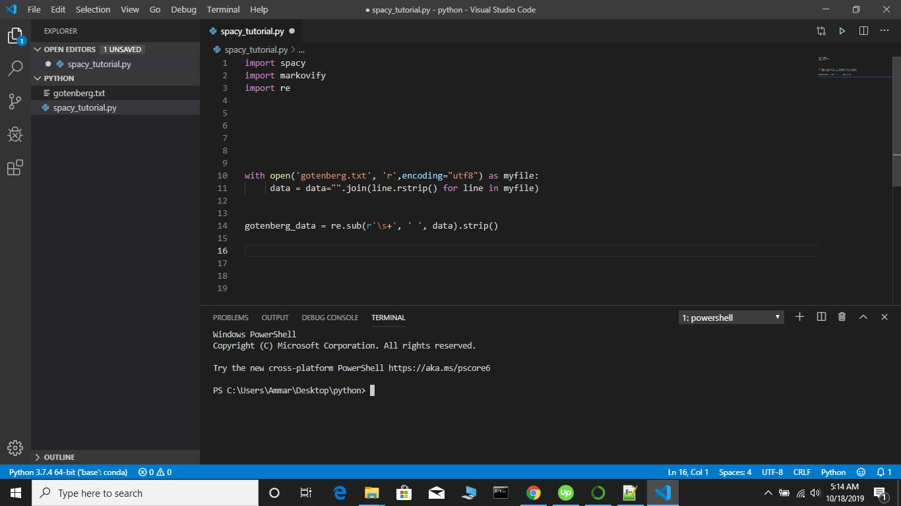
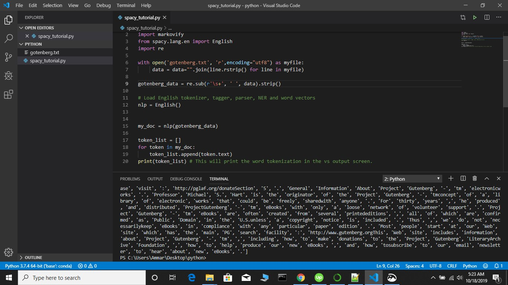
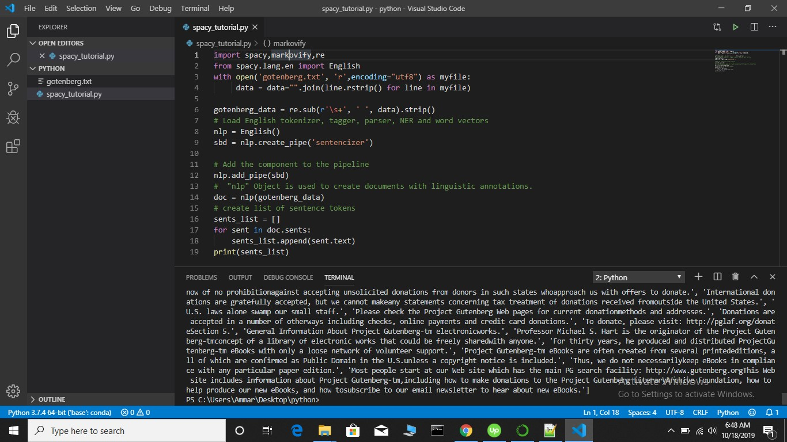
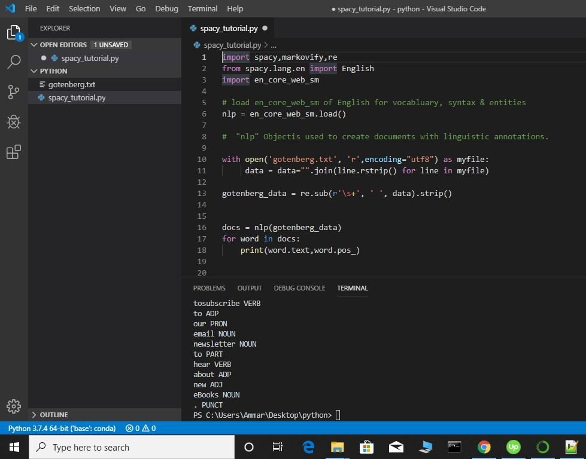

# Tutorial for spaCy and markovify installation
- In this tutorial we are going to show how to install spacy. So first of all what is spaCyy? 
spaCy is an open-source software library for advanced natural language processing, written in the programming languages Python and Cython. For more information about spaCy usage and other features have a look [here](https://spacy.io/usage/spacy-101).

- Natural language processing (NLP) is a subfield of linguistics, computer science, information engineering, and 
artificial intelligence concerned with the interactions between computers and human (natural) languages,
in particular how to program computers to process and analyze large amounts of natural language data. 

- So lets move onto spaCy installation. We will install spaCy using Anaconda. For easily installing python packages on windows install [Anaconda](https://www.anaconda.com/distribution/). Keep in mind that this link is has both 64 bit and 32 bit
distributions of Anaconda you should choose which suits your system. Here is a very [cool guide](https://problemsolvingwithpython.com/01-Orientation/01.03-Installing-Anaconda-on-Windows/) for installing Anaconda for with recommended options that will be used for this tutorial. 

- After you install Anaconda, write Anaconda in the search button of windows and click on Anaconda prompt as shown below:
 
  

- Open Anaconda prompt and type: 


```
conda install -c conda-forge spaCy
```

- This is shown in screenshot given below as 


- For installing Markovify write following code:

```
conda install -c conda-forge markovify
```

- This is shown in screenshot given below as 


If there are no errors during installation and you start watching the conda prompt blinking again then this means that spaCy and markovify has been installed correctly.


## Working with spaCy

- For ease of useness we will be using visual studio code that comes with Anaconda. Click on Anaconda Navigator as shown below:
  
  


- Click on Visual studio code and open it as shown below:


- Now we will work with spaCy in Visual Studio code. For working with python in visual studio code just create a folder titled **python_code** on Desktop as shown below


- Choose the option for folder in Visual studio as shown below:


- Now open this folder in Visual Studion as shown below:


- Create a file in python_code folder named spacy_tutorial with code given below

```
import spacy
import markovify
```
- This is shown as below:


- Import spacy using the code given below:


- Now open this file in Visual studio and compile it using the green option on top right of the compiler as given below: 


- If there is no error in the output then this means that spaCy and markovify has been installed correctly

- You can compile all the code in Visual studio code as shown in the above screenshot.

## Natural Language Processing with spaCy and Markovify
 
Now we will move further with our tasks related to natural language processing. This tutorial will focus on following aspects of natural language processing. For this purpose wre will be using the datasets from Gotenberg project which are given [here](http://www.gutenberg.org/files/11/11-0.txt). We will read this file in python using the code given below,
```
# importing regex for removing duplicate whitespaces
import re 

# Read the file **gotenberg.txt** in python as myfile
with open('gotenberg.txt', 'r',encoding="utf8") as myfile:
     data = data="".join(line.rstrip() for line in myfile)


# Removing duplicate white spaces from the file
data1 = re.sub('\s+', ' ', data).strip()
```

Update **spacy_tutorial.py** using code given above so the whole code becomes

```
import spacy
import markovify
import re

with open('gotenberg.txt', 'r',encoding="utf8") as myfile:
     data = data="".join(line.rstrip() for line in myfile)

data1 = re.sub(r'\s+', ' ', data).strip()
```

This is shown in screenshot given below as:




### Tokenization

Tokenization is the process of breaking a given character sequence into pieces called tokens. There are two types of tokenization. One is word tokenization and second is sentence tokenization.

#### Code for Word tokenization
The code for word tokenization is given below:

```
from spacy.lang.en import English

# Load English tokenizer, tagger, parser, NER and word vectors
nlp = English()


my_doc = nlp(gotenberg_data)

token_list = []
for token in my_doc:
    token_list.append(token.text)
print(token_list) # This will print the word tokenization in the vs output screen.
```

Update **spacy_tutorial.py** using code given above so the whole code becomes

```
import spacy
import markovify
from spacy.lang.en import English
import re

with open('gotenberg.txt', 'r',encoding="utf8") as myfile:
     data = data="".join(line.rstrip() for line in myfile)

gotenberg_data = re.sub('\s+', ' ', data).strip()

# Load English tokenizer, tagger, parser, NER and word vectors
nlp = English()


my_doc = nlp(gotenberg_data)

token_list = []
for token in my_doc:
    token_list.append(token.text)
print(token_list) # This will print the word tokenization in the vs output screen.
```

This is shown in screenshot given below :



#### Code for Sentence tokenization
The code for Sentence tokenization is given below:

```
from spacy.lang.en import English
# Load English tokenizer, tagger, parser, NER and word vectors
nlp = English()
sbd = nlp.create_pipe('sentencizer')

# Add the component to the pipeline
nlp.add_pipe(sbd)

#  "nlp" Object is used to create documents with linguistic annotations.
doc = nlp(gotenberg_data)

# create list of sentence tokens
sents_list = []
for sent in doc.sents:
    sents_list.append(sent.text)
print(sents_list)
```
This is shown in screenshot given below:



### Lemmatization and Stemming

Lemmatisation (or lemmatization) in linguistics is the process of grouping together the inflected forms of a word so they can be analysed as a single item, identified by the word's lemma, or dictionary form.

In linguistic morphology and information retrieval, stemming is the process of reducing inflected (or sometimes derived) words to their word stem, base or root form—generally a written word form. The stem need not be identical to the morphological root of the word; it is usually sufficient that related words map to the same stem, even if this stem is not in itself a valid root.

### Parts of speech tagging

Part-of-speech tagging (POS tagging or PoS tagging or POST), also called grammatical tagging is the process of marking up a word in a text (corpus) as corresponding to a particular part of speech, based on both its definition and its context—i.e., its relationship with adjacent and related words in a phrase, sentence, or paragraph.

Here is the code for applying parts of speech tagging in python for **gotenberg_data** :

```

import en_core_web_sm

# load en_core_web_sm of English for vocabluary, syntax & entities
nlp = en_core_web_sm.load()


with open('gotenberg.txt', 'r',encoding="utf8") as myfile:
     data = data="".join(line.rstrip() for line in myfile)

gotenberg_data = re.sub(r'\s+', ' ', data).strip()


#  "nlp" Objectis used to create documents with linguistic annotations.
docs = nlp(gotenberg_data)
for word in docs:
    print(word.text,word.pos_)
```

Add this code to the file **spacy_tutorial** as given below:


```
import spacy,markovify,re
from spacy.lang.en import English
import en_core_web_sm

# load en_core_web_sm of English for vocabluary, syntax & entities
nlp = en_core_web_sm.load()


with open('gotenberg.txt', 'r',encoding="utf8") as myfile:
     data = data="".join(line.rstrip() for line in myfile)

gotenberg_data = re.sub(r'\s+', ' ', data).strip()


#  "nlp" Objectis used to create documents with linguistic annotations.
docs = nlp(gotenberg_data)
for word in docs:
    print(word.text,word.pos_)
```

This is shown in screenshot given below as:



If you get any error like **No module named 'en_core_web_sm'** then type the code given below in Anaconda prompt as shown [in this screenshot](https://github.com/ammarsabircheema/computing_tutorials/blob/master/Spacy_and_Markovify_tutorial/images/check1.jpg) and [here](https://github.com/ammarsabircheema/computing_tutorials/blob/master/Spacy_and_Markovify_tutorial/images/screen1.PNG).

```
python -m spacy download en
```


### Entity Detection

Named-entity recognition (NER) (also known as entity identification, entity chunking and entity extraction) is a subtask of information extraction that seeks to locate and classify named entity mentions in unstructured text into pre-defined categories such as the person names, organizations, locations, medical codes, time expressions, quantities, monetary values, percentages, etc.

### Dependency Parsing

Dependency Parsing is a natural language processing technique that helps us find meaning of a sentence by analyzing the structure of the sentence by through relationships between words.

### Word Vector Representation

A word vector is a numeric representation of a word that commuicates its relationship to other words.
### Text Classification


